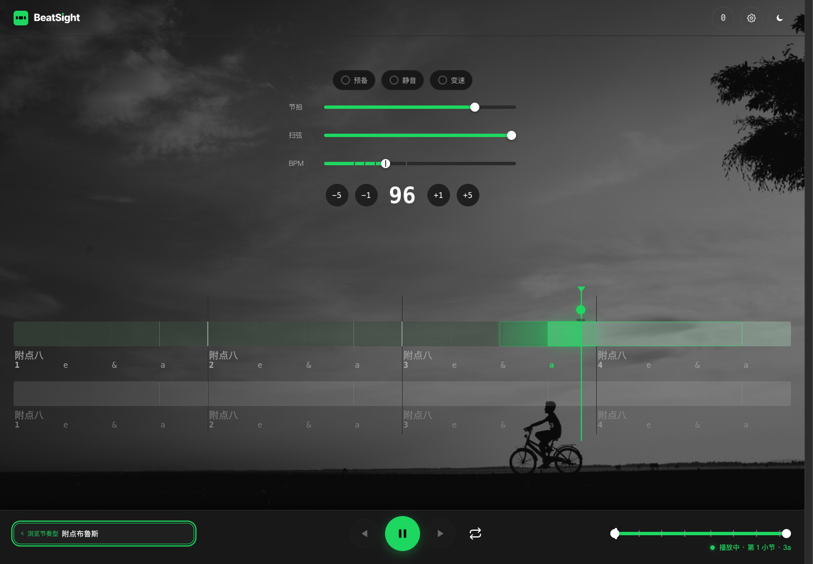
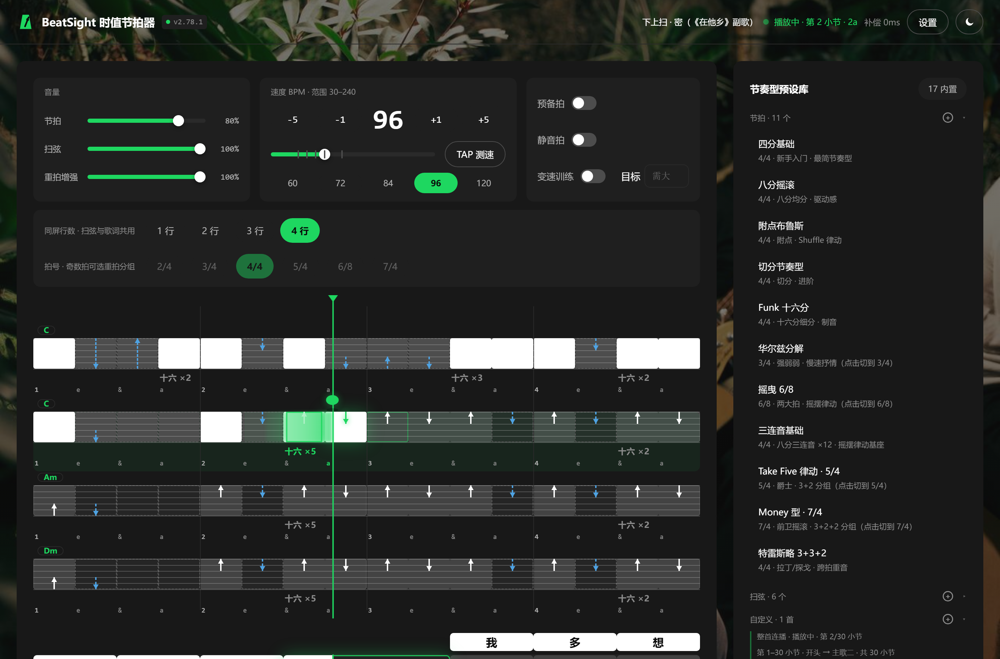
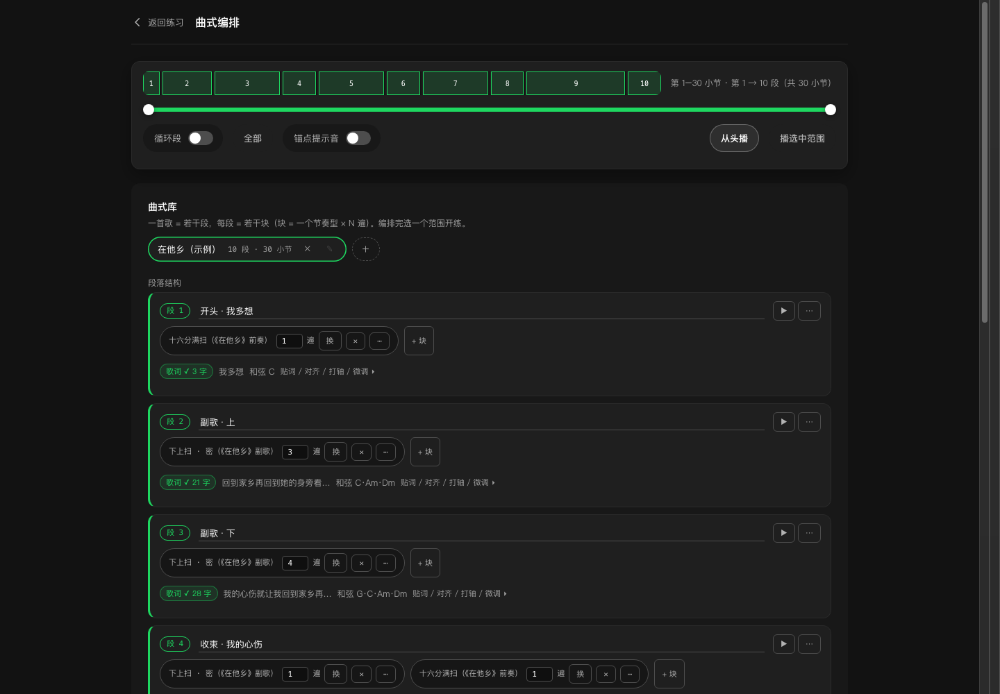
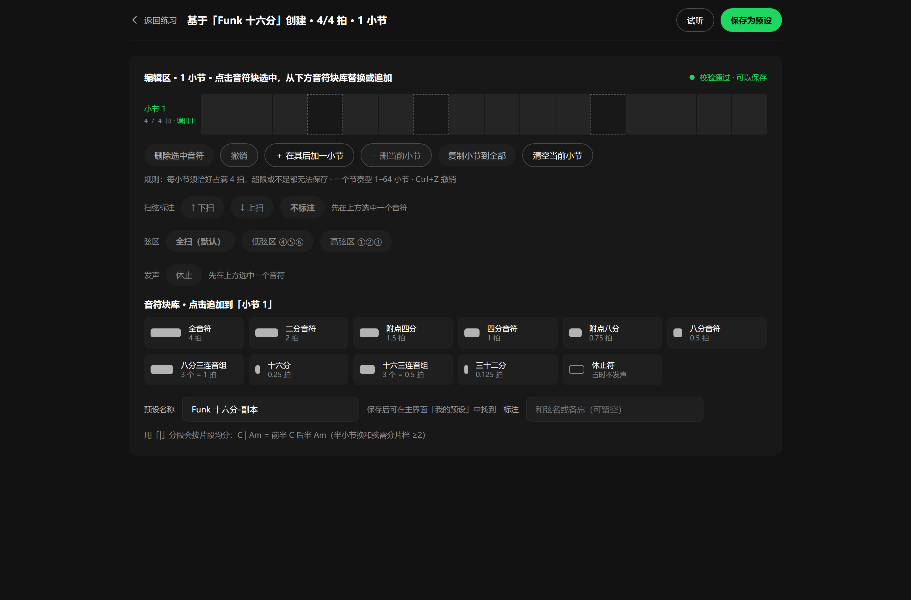
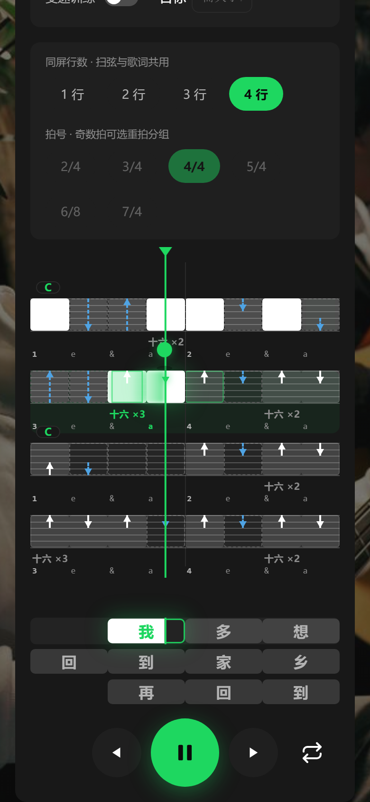
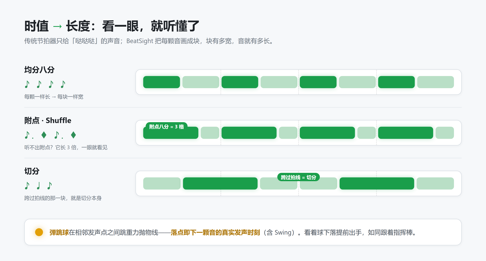

<p align="center">
  <picture>
    <source media="(prefers-color-scheme: dark)" srcset="docs/assets/banner-dark.png">
    
  </picture>
</p>

<p align="center">
  <a href="LICENSE"></a>
  <a href="https://github.com/chj0124/beatsight/actions"></a>
  <a href="https://beatsight.chenhuajian1995.workers.dev/"></a>
  <a href="https://beatsight.app.workbuddy.host/"></a>
</p>

<p align="center">
  <b>吉他练习用的节奏可视化节拍器。</b><br>
  传统节拍器只给「哒哒哒」；BeatSight 把每颗音画成块——块有多宽，音就有多长。
</p>

<p align="center">
  <a href="#这是什么">这是什么</a> ·
  <a href="#看一眼">看一眼</a> ·
  <a href="#它是怎么工作的">它是怎么工作的</a> ·
  <a href="#功能一览">功能一览</a> ·
  <a href="#快速开始">快速开始</a> ·
  <a href="#开发者">开发者</a> ·
  <a href="#文档">文档</a>
</p>

## 这是什么

BeatSight 是给吉他自学者做的节拍器。练琴时最劝退的不是「跟不上」，而是**听不出**——附点到底长了多少？切分到底错在哪？光靠耳朵，很多人练很久也建立不起这个直觉。

BeatSight 的做法是把节奏**画出来**：每颗音是一个块，块宽与时值严格成正比；一只弹跳球在发声点之间跳抛物线，落点即下一颗音的真实时刻。眼睛先学会，耳朵就跟上了。

工程形态上它走另一个极端：**单文件、零运行时依赖、无构建**——全部功能在 `index.html` 一个文件里，双击即开，不装任何东西、不发任何请求；数据只存本机 `localStorage`，无账号、无上传；在线版可安装为 PWA，装完断网照常练习。

## 看一眼

<table>
  <tr>
    <td width="50%"><b>主界面 · 播放中</b>（附点布鲁斯）</td>
    <td width="50%"><b>曲式模式</b> ·《在他乡》整首连播中</td>
  </tr>
  <tr>
    <td></td>
    <td></td>
  </tr>
  <tr>
    <td><b>曲式编排</b> · 歌曲地图 + 段落卡片 + 歌词对齐</td>
    <td><b>自定义编辑器</b> · 音符块库画自己的节奏型</td>
  </tr>
  <tr>
    <td></td>
    <td></td>
  </tr>
</table>

<p align="center">
  <br>
  <sub>手机浏览器直开，窄屏自动分片。截图均为真实运行中的页面（应用内「经典」主题）。</sub>
</p>

## 它是怎么工作的

<picture>
  <source media="(prefers-color-scheme: dark)" srcset="docs/assets/how-dark.png">
  
</picture>

- **弹跳球预判落点**：球在相邻发声点之间跳重力抛物线，落点即下一颗音的真实发声时刻（含 Swing）——看着球下落提前出手，如同跟指挥棒；跳距与时值成正比，静音小节照跳、休止符长跳跨过
- **同屏 N 行窗口**（1–4 行可调）：曲式模式下是歌曲正在弹的连续 N 个小节，页末行原地替换为「下一小节 · 型名」预告行，扫弦可提前备型；型短于 N 绕回铺满，型长于 N 按 N 行翻页
- **蓝牙/设备延迟补偿**：把声音按设备延迟统一提前（0–500ms），滑杆手动微调，按设备存多套配置——戴蓝牙耳机练也能对齐

## 功能一览

当前 `v3.1.8`。逐版本变更见 [CHANGELOG.md](CHANGELOG.md)（v0 / v1 / v2 三条老线分卷在 [docs/archive/CHANGELOG-v0.md](docs/archive/CHANGELOG-v0.md)、[docs/archive/CHANGELOG-v1.md](docs/archive/CHANGELOG-v1.md) 与 [docs/archive/CHANGELOG-v2.md](docs/archive/CHANGELOG-v2.md)）；完整操作说明在应用内顶栏「使用方法」页。

| | |
|---|---|
| **节拍内核** | Web Audio 时钟调度，tick 制节奏模型（每拍 48 tick）；时值可视化（格子宽度与音符时值严格成正比）；BPM 30–240（数字输入 / 滑杆 / TAP 测速 / 常用档快捷键）；拍号 2/4–7/4，奇数拍可选重拍分组；三条独立音量（节拍 / 扫弦 / 重拍增强）；音频延迟补偿 |
| **节奏库与编辑器** | 17 个内置预设（12 条通用型 + 5 条《在他乡》示例型），按「节拍 / 扫弦 / 自定义」三区堆叠（宽屏三列并列）；抽屉搜索过滤、条目 ▶ 试听；自定义编辑器（时值校验、试听、增删小节 1–64、发声开关、本地保存）；预设导入导出 JSON |
| **记谱与训练** | 扫弦方向标注 ↑↓、空扫、弦区三档（全扫 / 低 / 高）；和弦标注（块级逐小节、型级整段备忘）；预备拍、静音拍（N/M 或随机）；三套程序合成音色（电子 / 木鱼 / 鼓组）；Swing 三档 |
| **可视化** | 弹跳球预判落点、十六分小格 `1 e & a`、当前高亮、同屏 1–4 行窗口（出厂 2 行）、首用图例条（可关）、双主题（经典深色 / 日间浅色）、自选背景壁纸、窄屏自动分片 |
| **练习与编排** | 变速训练（从当前速度自动爬坡到目标）、听辨训练（听 2 小节选记谱）；曲式编排（段 = 节奏型 × N 遍）、歌曲地图单点跳段、播放范围双滑块、歌词逐字对齐到格子；内置示例曲《在他乡》30 小节逐小节谱 |
| **数据与平台** | 全部存本机 `localStorage`，无账号、无上传；「导出全部数据」整包带走（预设 + 曲式编排 + 歌词对齐 + 听辨战绩），导入按合并语义写回；单文件零依赖、PWA 离线安装、后台保活 |

<details>
<summary><b>老用户请注意：关键行为变化</b>（相对旧版本会改变操作方式的几处，完整史料在 CHANGELOG）</summary>

- **v2.10.12 / v2.10.15**：画面图层（主题 / 弹跳球 / 六线底纹 / 音色）收进顶栏「设置」小窗；音量三条留在主界面状态灯下方，练习中随时调。
- **v2.11.2**：「起始 BPM」「7 天计划」「继续上次训练」整块下线，变速训练从**当前速度**起步。
- **v2.13.0**：出厂自带一张默认壁纸；「移除」后不会自动回来，用「恢复默认」找回。
- **v2.28.0**：「整首连播」按钮删除——**点曲式条目就是整首连播**。
- **v2.30.0 / v2.31.0**：编排页改卡片排版；「开练」面板移到顶部全宽走带条（吸顶），段行「起 / 终」退役，改用 ⋯ 菜单「练这段」。
- **v2.32.0**：段歌词默认折叠成一行摘要。
- **v2.36.0**：设置新增「宽屏铺满」开关（默认关）。
- **v3.1.0**：预设库改版——主界面卡片只留「浏览节奏型 ▾」主钮（抽屉里才是完整列表，支持搜索，
  选型后抽屉不再自动收起，Esc 可关）；可视化带顶部有一行可关闭的图例；**出厂同屏行数从 4 改为 2**
  （改过行数的老用户不受影响，想回 4 行点「同屏行数 → 4 行」即可）；预设条目新增 ▶ 试听。

</details>

## 快速开始

| 方式 | 入口 | 什么时候会更新 |
|---|---|---|
| **在线 ①（Cloudflare，自动）** | https://beatsight.chenhuajian1995.workers.dev/ | 仓库接 Git，推 `main` 即自动构建部署，**线上始终是最新代码** |
| **在线 ②（WorkBuddy，手动）** | https://beatsight.app.workbuddy.host/ | 仅在你用 WorkBuddy 打开项目并发布时才更新，**滞后是常态**，别拿它判断「线上是不是最新版」 |
| **本地** | 双击 `index.html` | 与仓库同版；任意现代浏览器，手机浏览器同样适用 |

- 两条在线渠道都支持 PWA 安装到桌面 / 主屏幕。
- 首次发声需先点击页面任意位置（浏览器音频策略）。空格键开始 / 停止。
- ⚠️ **两种用法的数据不互通**：`file://` 与 `https://` 是不同 origin，`localStorage` 不共享。在本地攒的预设，打开在线版会看到空的——迁移请用「导出预设 / 导入预设」，或「导出全部数据 / 导入全部数据」。

## 开发者

Node ≥ 22，**核心闸门零安装**——不装任何东西也能跑完整套自验：

```bash
node tools/check-all.js          # 共 18 步：语法 → 架构约束 → 装配完整性 → 零依赖 lint → 版本一致性 → 文档一致性 → _headers 结构 → DOM 节点账本 → 测试桩能力对账 → 资源体积预算 → CSS 孤儿扫描 → ESLint（可选）→ 类型检查（可选）→ DOM 引用 → 浏览器冒烟（环境可选）→ 全量测试 → 死循环看门狗 → 行覆盖率
node tools/check-all.js --quick  # 跳过 T21 全量组合扫描（改代码时用）
```

- 18 步里有 3 步可能标 ⊘（**未执行**，不等于通过）：ESLint / 类型检查缺 `node_modules`、浏览器冒烟缺本机浏览器。它们绝不会因为「没装开发依赖」堵住部署；`npm install` 后自动启用。耗时刻意不写进文档（`tools/check-docs.js` 强制），命令末尾会自己打印「全部通过 · 实跑 N/M 项 · 用时 Xs」。
- CI 在 `.github/workflows/ci.yml`：push 与 PR 都跑 `npm run ci`，并另开一个 job 跑真实浏览器冒烟——它是对所有分支生效的**补位**，Cloudflare 那条路只拦推到 main 的那次构建。
- 发版纪律：`index.html` 的 `const VERSION` 是唯一真相源，**每次发版必 bump**（`package.json` / `package-lock.json` / `CHANGELOG.md` 首条由 `check-version.js` 强制一致）；发布前跑一次全量 `node tools/check-all.js`；视觉/手感类改动另需人眼验收，冒烟看不出「好不好用」。
- 可选但推荐：`sh tools/install-hooks.sh` 装 pre-commit 钩子，每次提交自动跑 `--quick`。
- 双渠道对账：`node tools/check-deploy-parity.js` 只读核对「线上到底是哪一版」（本地版本对齐 + `dist/` 产物集与安全头）。

渠道强制力差异（WorkBuddy 纯手动零拦截 vs Cloudflare 构建硬闸门）、Dashboard 那行 `npm run ci` 为什么缺一不可、类型闸门的取舍——这些工程的「为什么」全部写在 [docs/DEVELOPMENT.md](docs/DEVELOPMENT.md)，不在此重复。

## 文档

| 文档 | 说明 |
|---|---|
| [README.md](README.md) | 本文件：项目定位、功能现状、发布与自验 |
| [AGENTS.md](AGENTS.md) | 开发协作约定：改动纪律、任务分流、禁区（面向 AI 编码助手） |
| [docs/DEVELOPMENT.md](docs/DEVELOPMENT.md) | 开发交接文档：架构、数据模型、设计规范、自验方法、路线图与技术债 |
| [docs/README.md](docs/README.md) | docs/ 目录索引：活文档与历史快照的分界线 |
| [CHANGELOG.md](CHANGELOG.md) | 当前大版本线（v2.x）版本记录 |
| [docs/archive/prd.html](docs/archive/prd.html) | 产品需求文档 v1.0（原始 PRD，**已归档**：现行功能以 CHANGELOG 为准） |
| [docs/archive/spec.md](docs/archive/spec.md) | 全维度代码审计与迭代规划（2026-09-17 审计，**已归档**：历史快照，按需查节） |
| [docs/archive/AUDIT-2026-09-21.md](docs/archive/AUDIT-2026-09-21.md) | 2026-09-21 诊断报告（基线 v2.8.9）：P0–P3 分级，P0/P1 已逐条处置 |
| [docs/archive/PLAN-v1.5.md](docs/archive/PLAN-v1.5.md) | 后续改进方案（v1.4.1→v1.5+，**已归档**：P0–P3 全部落地） |
| [docs/archive/PLAN-v1.9.md](docs/archive/PLAN-v1.9.md) | 后续开发方案（v1.8.2→v1.10）：工程债、扫弦标注、练习量、听辨训练（**已归档**：条目全部落地） |
| [docs/archive/PLAN-v2-arrangement.md](docs/archive/PLAN-v2-arrangement.md) | 曲式编排设计探针（18 条假设 / 三档对比 / D1–D8，**已归档 · 历史记录**） |
| [docs/archive/PLAN-v2-impl.md](docs/archive/PLAN-v2-impl.md) | 曲式编排实施方案（v2.0.0，**已落地**） |
| [docs/archive/PLAN-v3-arrange-redesign.md](docs/archive/PLAN-v3-arrange-redesign.md) | 编排重设计：G3 / G2 / G1 三阶段（**已全部交付**，本文转为历史记录） |
| [docs/archive/PLAN-v4-arrange-ui-rework.md](docs/archive/PLAN-v4-arrange-ui-rework.md) | 编排 UI 重设计 S1–S3（**已落地**：全部闭环） |
| [docs/archive/PLAN-v5-lyric-align-rework.md](docs/archive/PLAN-v5-lyric-align-rework.md) | 歌词对齐交互重设计 + 字块拖拽（**已落地**：四期全部完成；仅剩真机 390px 冒烟 + V9 截图复核两项验收） |
| [docs/archive/PLAN-v6-pat-viz.md](docs/archive/PLAN-v6-pat-viz.md) | 歌词区节奏型可视化（甲·块头节奏型行 + 乙·行内时值轮廓，**已落地**：v2.80.0 交付） |
| [docs/archive/PLAN-v7-lyric-inline.md](docs/archive/PLAN-v7-lyric-inline.md) | 歌词显示位置重设计（显示歌词开关 + 自动/伴随节奏/底部三态，**已落地**：v2.86.0 交付） |
| [docs/archive/CHANGELOG-v0.md](docs/archive/CHANGELOG-v0.md) | 大版本 v0.x 版本记录（分卷，**已归档**） |
| [docs/archive/CHANGELOG-v1.md](docs/archive/CHANGELOG-v1.md) | 大版本 v1.x 版本记录（分卷，**已归档**） |
| [docs/archive/tasks.md](docs/archive/tasks.md) | 审计落地任务清单（**历史快照 · 已归档**：耗时 / 步数 / 覆盖率 / 行号均为当时实测值） |
| [docs/archive/checklist.md](docs/archive/checklist.md) | 审计评审检查清单（**历史快照 · 已归档**） |

## 设计稿

视觉系统：深色沉浸练习舱（`#121212` 底 + `#1ED760` 功能绿 + 全胶囊控件），另有浅色「日间」主题；详见 `docs/DEVELOPMENT.md` 第 4 节。README 顶图与信息图由同一套视觉系统生成（深浅双版，跟随系统主题切换）。
交互设计稿（3 屏：桌面主界面 / 移动端 / 自定义编辑器，内部 Ardot 画布）：`https://ardot.tencent.com/file/721823967024298`

## 技术栈

原生 HTML/CSS/JS 单文件，Web Audio API 时钟调度，localStorage 持久化，无构建步骤、无运行时依赖。

## License

MIT
